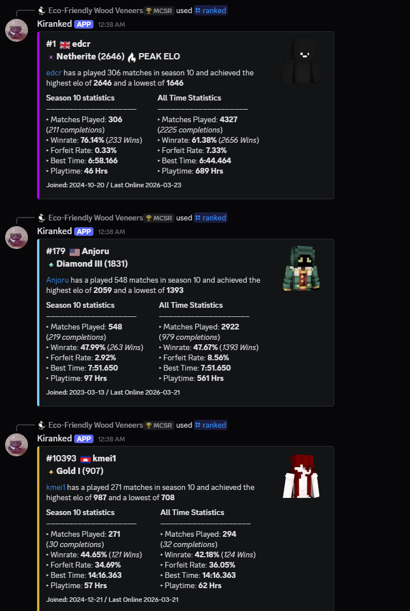
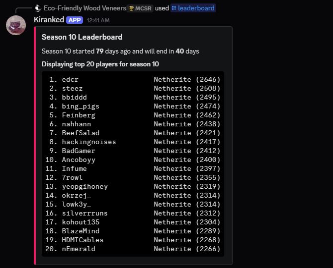
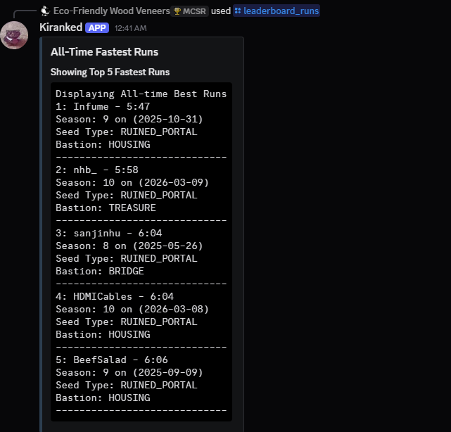
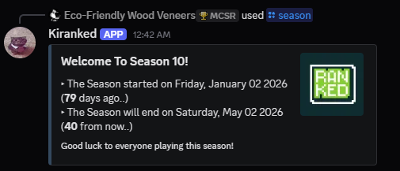
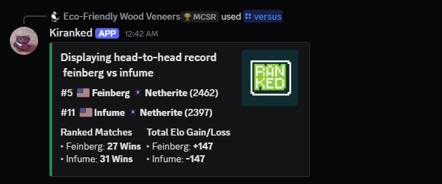

>[!WARNING]
>Currently, Development for this project will be held on pause as REDLIME (main programmer behind MCSR Ranked) is migrating the database and making changes to their API. This project will resume after the database changed.

## Kiranked
A simple discord bot to track player statistics and leaderboard data for MCSR Ranked using their API. 
The bot allows users to quickly check MCSR RANKED player stats, rankings, and other information directly from Discord.

## What is MCSR ranked? 
MCSR Ranked is a mod built for minecraft as a competitive matchmaking system for speedrunners to race against other players in ranked matches and climb a global ladder.
Learn more at the [official MCSR Ranked website](https://mcsrranked.com). 
For developers, the documentation for the MCSR Ranked API is available [here](https://mcsrranked.com/api)

## Features
- Track player statistics (Rank, Elo, Winrate) 
- Display the current season and leaderboard of top players
- View all-time best runs
- View a head-to-head record between two players

---

## Commands

| Command | Description | Options |
|---------|-------------|---------|
| `/ranked <username>` | Display a player's stats, elo, rank, winrate and match history for the current season and all-time | `username` - MCSR Ranked username |
| `/season` | Display current season info including start date, end date and days remaining | — |
| `/leaderboard` | Display the top players for the current season leaderboard | `limit` - Number of players to display |
| `/leaderboard_runs` | Display the all-time fastest ranked runs | `limit` - Number of runs to display |
| `/versus <user1> <user2>` | Display the head-to-head record between two players including elo gain/loss | `user1`, `user2` - MCSR Ranked usernames |

## Planned Improvements/Features
- [ ] Look for and fix edge-cases
- [ ] Match history with detailed stats (splits, average times, deathrates..)
- [ ] Better and comprehensive Head-to-head player comparison
- [ ] Season history and past leaderboards
- [ ] Incorperating a machine learning model to predict match outcomes between two players using detailed stats (as a fun addon).
- [ ] A database to store all matches
- [ ] Improve visuals for all-time best runs
 
---


## Screenshots

<details>
<summary>Player Stats</summary>



</details>

<details>
<summary>Leaderboard</summary>



</details>

<details>
<summary>Fastest Runs Leaderboard</summary>

 

</details>

<details>
<summary>Display Season time</summary>



</details>

<details>
<summary>Versus</summary>



</details>

---


## Installation

### Prerequisites
- Python 3.8+
- A Discord bot token from the [Discord Developer Portal](https://discord.com/developers/applications)

### Steps

1. Clone the repository
```bash
git clone https://github.com/yourusername/kiranked.git
cd kiranked
```

2. Install dependencies
```bash
pip install -r requirements.txt
```

3. Create a `.env` file and add your token
```env
DISCORD_TOKEN=your_token_here
```

4. Run the bot
```bash
python kiranked.py
```

Alternatively, you can add the bot directly using [this link](https://discord.com/oauth2/authorize?client_id=1480520045850267668).

---


## About this Project

I made this project in order to learn more about python and their built in libraries, learn about APIs (REST APIs in this case) whilst challenging myself by building something that is relevant to my hobbies on a platform that I use daily. This is my first ever solo project which I do plan on improving and expanding as this is only the first demo. Huge credits to the welcoming MCSR community, specifically their API Developer help channel, a channel for developers(beginner or experienced) to be able to share and help each other. 


